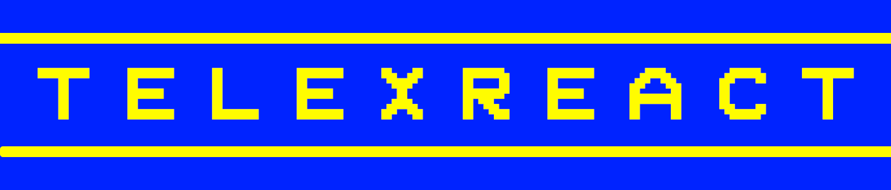

<h3 align="center">Classic Teletext World Clock made in React</h3>

---

#### Terms of Use

```
Feel free to test out the live-demo and the code found in this repo.
You may use parts of this code if it helps you with your own project.
If you do so, please abide with the licenses of the third-party
modules and files found in the Credits section. Production builds
of telexReact may be used if proper attribution is given.
```

#### Credits

```
moment-timezone by momentjs
Pixel Clock favicon obtained from freepik.com
```
